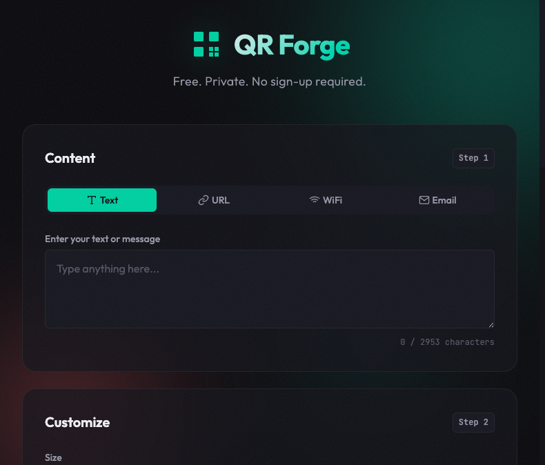
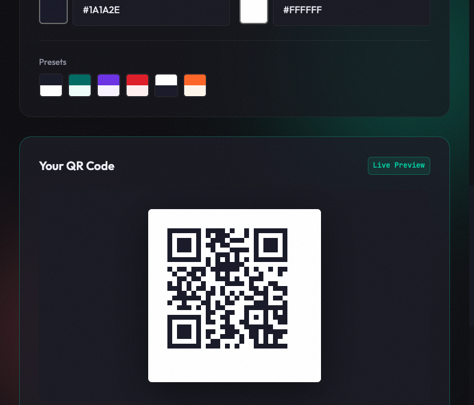
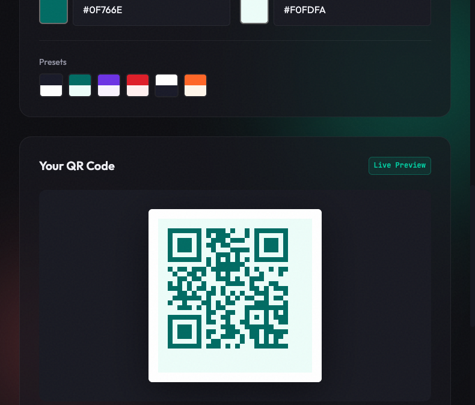

# QR Forge — Local QR Code Generator

A beautiful, privacy-focused QR code generator that runs entirely in your browser. No sign-ups, no external services, no tracking.

## Screenshots

### Main Interface

*Clean, modern interface with dark theme*

### QR Code Generation

*Live preview with customizable colors*

### Color Customization

*Beautiful color presets — shown here with teal theme*

## Features

- **100% Client-Side**: All QR codes are generated locally in your browser. No data is ever sent to any server.
- **Multiple Content Types**:
  - **Text**: Any text or message
  - **URL**: Website links (auto-adds https:// if needed)
  - **WiFi**: Generate QR codes to share WiFi credentials
  - **Email**: Create mailto: links with subject and body
- **Customization**:
  - Adjustable size (128px - 512px)
  - Error correction levels (L, M, Q, H)
  - Custom foreground and background colors
  - 6 beautiful color presets
- **Export Options**:
  - Download as PNG
  - Download as SVG (vector format, perfect for print)
  - Copy to clipboard

## Usage

Simply open `index.html` in any modern web browser. No server or installation required!

### Quick Start

1. Open `index.html` in your browser
2. Select content type (Text, URL, WiFi, or Email)
3. Enter your content
4. Customize colors and size as desired
5. Download or copy your QR code

### WiFi QR Codes

For WiFi QR codes, you'll need:
- Network name (SSID)
- Password
- Security type (WPA/WPA2, WEP, or None)
- Hidden network option if applicable

When scanned, the QR code will automatically connect the device to your WiFi network.

## Privacy

**Your data stays on your device.** QR Forge:
- ✅ Works completely offline (after initial load)
- ✅ No cookies
- ✅ No analytics
- ✅ No tracking
- ✅ No data collection
- ❌ Never sends data to external servers

## Technical Details

- Built with vanilla HTML, CSS, and JavaScript
- Uses [QRious](https://github.com/neocotic/qrious) library for QR code generation
- No build tools or dependencies required
- Works in all modern browsers (Chrome, Firefox, Safari, Edge)

## Files

```
qrcodegenerator/
├── index.html        # Main HTML file
├── styles.css        # Styling
├── app.js            # Application logic
├── qrcode.min.js     # QRious library (bundled)
├── README.md         # This file
└── screenshots/      # Screenshots for documentation
```

## License

Free to use for personal and commercial projects.

---

Built with ♥ — No tracking, no cookies, no BS.
